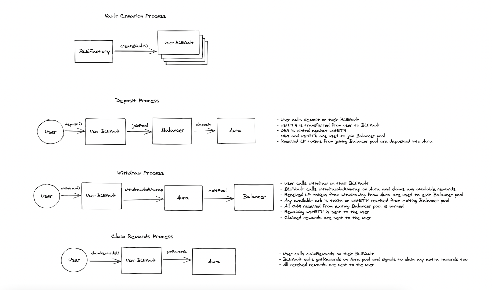

# OlympusDAO Contest Details (03/2023)

- Join [Sherlock Discord](https://discord.gg/MABEWyASkp)
- Submit findings using the issue page in your private contest repo (label issues as med or high)
- [Read for more details](https://docs.sherlock.xyz/audits/watsons)

## Overview

The purpose of this audit is to review the security of a new OlympusDAO product: Boosted Liquidity Vaults. This is a rearchitecture of the Single-Sided Liquidity Vault (SSLV) framework that previously underwent a Sherlock contest.

These contracts will be installed in the Olympus V3 "Bophades" system, based on the [Default Framework](https://palm-cause-2bd.notion.site/Default-A-Design-Pattern-for-Better-Protocol-Development-7f8ace6d263c4303b108dc5f8c3055b1). Olympus V3 was audited multiple times prior to launch in November, 2022. The currently deployed Olympus V3 contracts can be found on [GitHub](https://github.com/OlympusDAO/olympus-v3).
You can reference these audits here:

- Code4rena Olympus V3 Audit (08/2022)
  - [Repo](https://github.com/code-423n4/2022-08-olympus)
  - [Findings](https://github.com/code-423n4/2022-08-olympus-findings)
- Kebabsec Olympus V3 Remediation and Follow-up Audits (10/2022 - 11/2022)
  - [Remediation Audit Phase 1 Report](https://hackmd.io/tJdujc0gSICv06p_9GgeFQ)
  - [Remediation Audit Phase 2 Report](https://hackmd.io/@12og4u7y8i/rk5PeIiEs)
  - [Follow-on Audit Report](https://hackmd.io/@12og4u7y8i/Sk56otcBs)
- Kebabsec SSLV Audit (02/2023)
  - [Audit Report](https://hackmd.io/@12og4u7y8i/HJVAPMlno)

## On-chain context

```
DEPLOYMENT: mainnet
ERC20: OHM, wstETH, LDO, BAL, AURA
ERC721: none
ERC777: none
FEE-ON-TRANSFER: none
REBASING TOKENS: none
ADMIN: trusted
EXTERNAL-ADMINS: n/a
```

In case of restricted functions, by default Sherlock does not consider direct protocol rug pulls as a valid issue unless the protocol clearly describes in detail the conditions for these restrictions.
For contracts, owners, admins clearly distinguish the ones controlled by protocol vs user controlled. This helps watsons distinguish the risk factor.

- The address(es) with`liquidityvault_admin` permissions in `BLVaultManagerLido.sol` are owned by the protocol and is used to update configurations, and pause the system in-case of emergency.

## Audit scope

The contracts in-scope for this audit are:

```ml
src
├─ policies
|   ├─ BoostedLiquidity
|   |   ├─ BLVaultLido.sol
|   |   ├─ BLVaultManagerLido.sol
```

The in-scope contracts depend on these previously audited and external contracts:

```ml
src
├─ Kernel.sol
├─ policies
|   ├─ BoostedLiquidity
|   |   ├─ interfaces
|   |   |   ├─ IAura.sol
|   |   |   ├─ IBalancer.sol
|   |   |   ├─ ILido.sol
├─ modules
|   ├─ BLREG
|   |   ├─ BLREG.v1.sol
|   |   ├─ OlympusBoostedLiquidityRegistry.sol
|   ├─ MINTR
|   |   ├─ MINTR.v1.sol
|   |   ├─ OlympusMinter.sol
|   ├─ TRSRY
|   |   ├─ TRSRY.v1.sol
|   |   ├─ OlympusTreasury.sol
|   ├─ ROLES
|   |   ├─ ROLES.v1.sol
|   |   ├─ OlympusRoles.sol
├─ interfaces
|   ├─ AggregatorV2V3Interface.sol
├─ libraries
|   ├─ FullMath.sol
|   ├─ TransferHelper.sol
├─ external
|   ├─ OlympusERC20.sol
lib
├─ solmate
|   ├─ tokens
|   |   ├─ ERC20.sol
```

## Installation

- This project is built on Foundry and should be compatible with the latest version ([installation guide](https://github.com/foundry-rs/foundry))
- This project relies on the unix terminal program `jq` for certain test helpers ([installation guide](https://stedolan.github.io/jq/download/))

## Building

- To build the repository, call `forge build` in the console

## Testing

- To run the full test suite, call `forge test -vvv` in the console
- To run a specfic test file, call `forge test -vvv --match-path path/to/file` in the console

## Boosted Liquidity Vault (BLV) Overview

This project aims to build the capability and framework for the Olympus Treasury to mint OHM directly into liquidity pairs against select, high quality assets.

### Architecture

The BLV system is built using one central manager contracts and then a series of individual vaults per user. These individual vaults are deployed using the clones with immutable args architecture. This has the benefit of sequestering user assets and rewards, thus offloading the responsibility of managing their distribution to external protocols like Aura, all while remaining quite gas efficient. As a quick primer of clones with immutable args, they work by having one base implementation deployment which houses all the logic. When a clone is created, the immutable arguments (used as state) are stored directly in the bytecode of the deployment. Function calls are handled via `delegatecall` back to the logic housed in the base implementation contract.

### Diagram of Main User Flows



### Boosted Liquidity Vault Security Considerations

### General

- No users but each vault's owner should be able to access deposits or rewards in that vault
- Users should never be able to directly access the OHM or LP tokens custodied by the vault except when depositing into or withdrawing from Balancer

#### Emergency Process

- In the event of a bug or an integrated protocol pausing functionality there are steps that can be taken to mitigate the damage
- Deactivate the contract through the `deactivate` function which prevents further deposits, withdrawals, or reward claims in any user created vault until the issue has been effectively triaged and handled.

#### Tokens

- No tokens involved will be non-standard ERC20s. The relevant tokens are OHM, wstETH, AURA, BAL, and LDO.

#### Integrations

- The vaults integrate with Balancer
- The vaults integrate with Aura for handling rewards on top of the LP position
- Should an integrated protocol end up pausing, the boosted liquidity vaults would be in limbo until funds can be recovered

### Economic Brief

- BLVs should dampen OHM volatility relative to the counter-asset. As OHM price increases relative to the counter-asset, OHM that was minted into the vault is released into circulation outside the control and purview of the protocol. This increases circulating supply and holding all else equal should push the OHM price back down. As OHM price decreases relative to the counter-asset, OHM that was previously circulating has now entered the liquidity pool where the protocol has a claim on the OHM side of the pool. This decreases circulating supply and holding all else equal should push the OHM price back up.
- BLVs should behave as more efficient liquidity mining vehicles for partners. Initially Olympus will take no portion of the rewards provided by the partner protocol (and down the road will not take more than a small percentage). Thus the partner gets 2x TVL for its rewards relative to what it would get in a traditional liquidity mining system. Similarly, the depositor gets 2x rewards relative to what they would get in a traditional liquidity mining system. The depositor effectively receives 2x leverage on reward accumulation without 2x exposure to the underlying (and thus has no liquidation risk).
- Users of BLVs will experience identical impermanent loss (in dollar terms) as if they had split their pair token deposit into 50% OHM - 50% pair token and LP'd.
- In theory this system could be gamed by single-sided depositing through the vault, performing a large swap (either via user balance, a large loan, or a flash loan) to shift more of the LP into wstETH, then exiting the pool. To mitigate this the contract checks the withdrawn ratios of OHM and wstETH against the current oracle price and takes any wstETH shifted imbalance as a fee to the treasury. The math used to accomplish this slightly weights the exchange rate further in favor of the treasury rather than reverse engineering the invariant math to get an exact exchange rate since in most scenarios these discrepancies will be very small and it's more effective at dissuading large attempts to shift the pool around. It also does this without actually rebalancing the pool.
